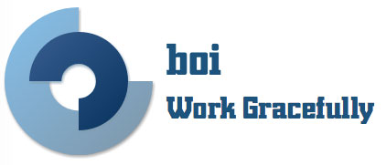

  

  
  

   

  

  
  
  

  

  
  
  
  

   

  

    

    boi是一套完整的前端工程化解决方案，涵盖项目的起始、开发、测试以及部署阶段。
    

     
    

    目前boi版本为v3.x，构建系统基于[webpack v3](https://webpack.js.org/)。构建产出代码支持IE8以上版本浏览器。
    

     
    

    命名来源： boi是bolshoi（莫斯科大剧院）的简写。bolshoi是天鹅湖舞剧首演场所。
    

    

    
  

  

