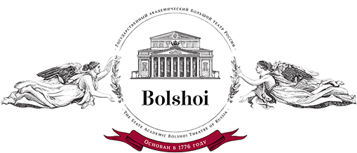

boi是一套完整的前端工程化解决方案，涵盖项目的起始、开发、测试以及部署阶段。

目前boi版本为v2.x，构建系统迁移至[webpack v2](https://webpack.js.org/)。构建产出代码不再支持IE8及以下版本IE浏览器。如果你的项目需要兼容IE8浏览器，请使用[boi v1](https://zhoujunpeng.gitbooks.io/boi/content/)版本。

> 命名来源： boi是bolshoi（莫斯科大剧院）的简写。bolshoi是天鹅湖舞剧首演场所。
>
> 
