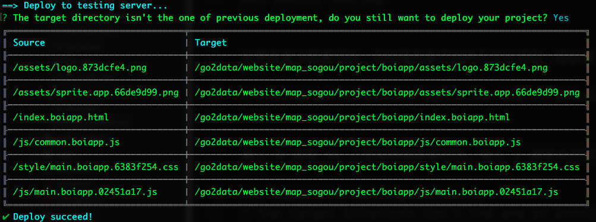
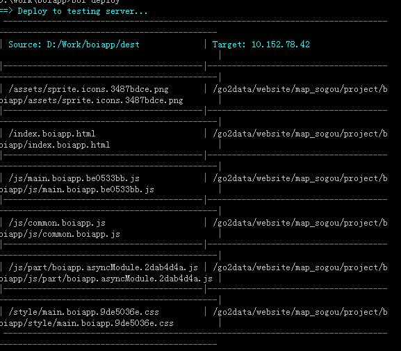
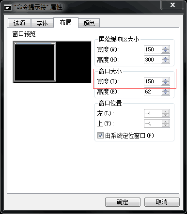

## 远程部署

boi提供一键部署功能，在项目**根目录**下运行：

```bash
boi deploy --env <env>
```

其中`<env>`代表部署的环境，取值与[环境配置](_config-env.md)相同。

请注意，**`deploy`动作并不会对源码进行编译**，所以请确保在执行`deploy`之前已经成功完成了`build`流程，并且**一定要保证`deploy`和`build`的是在相同环境（`<env>`）下执行**。

### 配置

使用`boi.deploy(options)`API进行远程部署服务器信息配置。

`options`：`Object`，包括以下子配置项：
* `cdn`：cdn服务器配置，包括以下子配置项:
    * `domain`：cdn服务器域名；
    * `path`：项目存放在cdn服务器的路径
* `connect`：连接配置，包括以下子配置项：
  * `type`：`String`，部署文件协议。boi支持两种连接协议：`ftp`和`sftp`；
  * `config`：`Object`，连接配置，包括以下子项：
    * `host`：`String`，目标服务器域名或者IP地址。如果使用域名，请确保此域名可识别（可以运行ping命令检测）；
    * `port`：`Number|String`，目标服务器端口；
    * `path`：`String`，目标服务器部署目录；
    * `auth`：`Object`，登录目标服务器的用户名和密码：
      * `username`：`String`，登录部署服务器的用户名；
      * `password`：`String`，登录部署服务器的密码。

### 示例

以下是通过`sftp`协议部署的boi配置项：

```JavaScript
boi.deploy({
    // 测试环境
    testing: {
      // cdn前缀
      cdn:{
        domain: 'test.sogou.com',
        path: '/boiapp/'
      },
      connect: {
        // 连接协议
        type: 'sftp',
        // 目标ip和path
        config: {
          host: '192.168.1.1',
          path: '/go2data/website/map_sogou/project/boiapp/',
          auth: {
            username: 'admin',
            password: '123456'
          }
        }
      }
    },
    // 生产环境
    prod: {
      cdn:{
        domain: 'map.sogou.com',
        path: '/boiapp/'
      },
      connect: {
        type: 'sftp',
        config: {
          host: '192.168.1.2',
          path: '/map/project/boiapp/',
          auth: {
            username: 'adming',
            password: '123456'
          }
        }
      }
    }
});
```

首先运行build命令，以测试环境为例：
```bash
boi build testing
```

构建成功之后运行deploy命令：
```bash
boi deploy testing
```

如果是首次部署项目，目标服务器可能并不存在项目一级目录（上述配置中的`boiapp`目录），boi会出现以下提示：
```bash
? The target directory isn't the one of previous deployment, do you still want to deploy your project?
```

输入`N`或者`no`之后会终止部署行为。输入`y`或者点击回车键会继续运行部署流程。部署成功之后会出现以下提示：


### boi判断部署目录是否为历史同一目录的方法
如果部署目标是一个全新的目录或者不是当前项目上次部署的同一目录的话，boi会提示用户是否仍然将项目部署到此目录：
```bash
? The target directory isn't the one of previous deployment, do you still want to deploy your project?
```

boi在首次部署当前项目后会在目标服务器创建一个特殊的flag文件，命名规则是`<appName>.flag`。其中`appName`是`boi-conf.js`中配置的项目名称。boi在之执行部署上传之前首先会检测部署目录是否存在此flag文件，如果存在则代表部署目录是当前项目的历史部署目标；如果不存flag文件则代表部署目录是一个全新的目录。

### windows兼容问题
boi的部署功能兼容windows系统，但是部署成功后输出的成功提示可能会显示错乱，如下图：


这个问题只会出现在windows系统自带的cmd终端中，是因为windows自带的cmd终端默认配置窗口大小为80，不能容纳输出信息的长度，从而出现了折行。

解决问题的方法如下：点击cmd终端左上角弹出菜单->选择属性->布局->参照下图将终端窗口大小调大->点击确定后重启终端即可解决显示折行问题。


